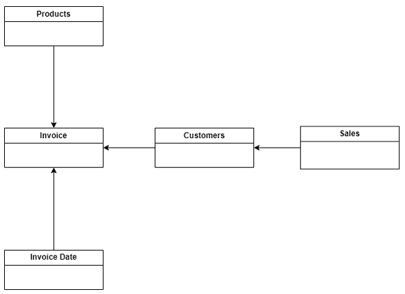
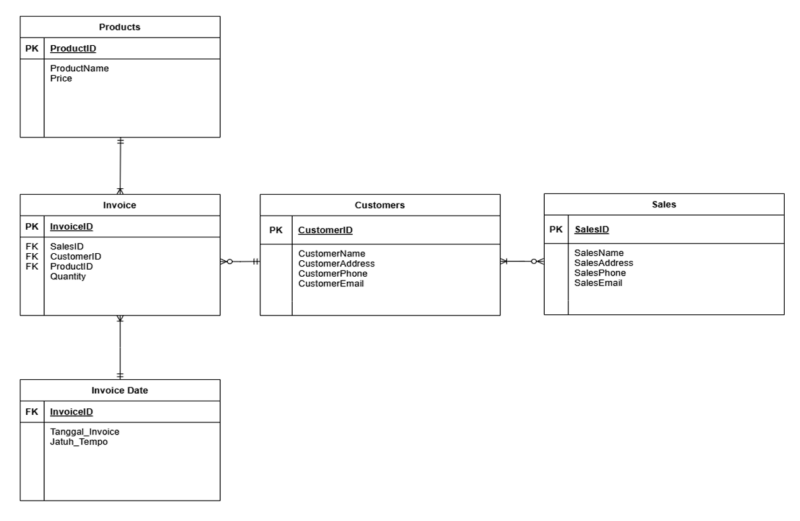
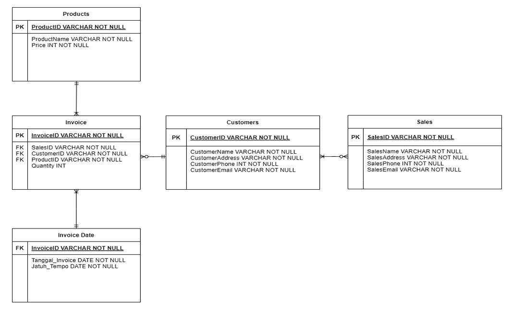
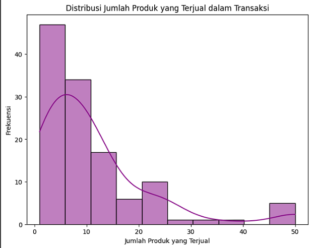

# 🗄️ Database Design Project - Invoice Management System  

This repository contains our **Database Technology Final Project** at **Binus University**, focusing on designing and implementing a relational database for an **Invoice Management System**.  
The project applies **data normalization (UNF → 1NF → 2NF → 3NF)**, ERD modeling, SQL implementation, and visualization.  

---

## 👥 Team Members (Group 1)
- Aaron Lawrence (2702239763)  
- Brandon Lim Santosa (2702239391)  
- Dimas Bramantyo Putra Santoso (2702237386)  
- Ignatius Abraham Aristio Kusnadi (2702243590)  
- Kalvin (2702238804)  

**Department:** School of Computer Science  
**University:** Binus University  
**Academic Year:** 2024  

---

## 📌 Project Background
Invoices are essential in sales transactions, but poorly structured data often causes duplication, inconsistencies, and inefficiency.  
In this project, we normalized unstructured invoice data (UNF) into **3NF** to ensure:  
- ✅ Reduced data duplication  
- ✅ Improved data integrity  
- ✅ Easier data management  
- ✅ Better support for reporting & decision-making  

---

## 🎯 Objectives
- Apply **normalization** from UNF → 1NF → 2NF → 3NF.  
- Design **ERD, logical, and physical diagrams**.  
- Implement database using **MySQL**.  
- Demonstrate **SQL queries, views, and constraints**.  
- Visualize insights from the database.  

---

## 🧩 Methodology
1. **Data Collection** → 115 invoices simulated (INV001–INV115).  
2. **Unnormalized Form (UNF)** → Raw invoices stored in one table.  
3. **Normalization** → Step-by-step normalization up to 3NF.  
4. **Database Design** → ERD, logical schema, physical schema.  
5. **Implementation** → SQL scripts in MySQL.  
6. **Testing & Validation** → Queries for integrity and performance.  

---

## 🏗 Database Design

### Conceptual Diagram
  

### Logical Diagram
   

### Physical Diagram
  

**Entities:**  
- Invoice  
- Invoice_Date  
- Sales  
- Customers  
- Products  

---

## 🔎 Implementation
- Built in **MySQL**.  
- Includes **Primary Keys, Foreign Keys, Constraints**.  
- Populated with 115 simulated invoices.  
- Tested with multiple **JOIN queries** and aggregation.  

---

## 📊 Visualization
Visualization was performed using **Google Colab**, including:  
1. Total Sales by Product  
2. Total Sales by Salesperson  
3. Total Purchases by Customer  
4. Quantity of Sales per Product  
5. Frequency of Products Sold  

- Example Visualization Number 5
📷   

### Full Code 
🔗 [Visualization Notebook (Google Colab)](https://colab.research.google.com/drive/1ueCsh1yNBIWdA37O8HCCYL88tajPyHcP?usp=sharing)  

---

## 📂 Project Files
- [UNF Table (Google Sheets)](https://docs.google.com/spreadsheets/d/1y6b8YvqX-pf09uYNEfNtvaIxr4r2CXHEhoQMqR4YMvQ/edit?usp=sharing)  
- [Normalization Steps (UNF → 3NF)](https://docs.google.com/spreadsheets/d/1iZwwOQzYXHCCAIhYfGytzvz0G6Tin1Sx8WA7hJf9RUE/edit?usp=sharing)  
- [SQL Code](https://drive.google.com/file/d/1gjXop6rh2WQ6I0zFaQrZ3MEMYS_8WRs2/view?usp=sharing)  
- [Presentation Slides](https://drive.google.com/drive/folders/1IKldgdJdJ3ygorauMubiAxNb3IO3UMZl?usp=sharing)  

---

## ✅ Results
- A **well-structured, normalized database** free from redundancy.  
- **Efficient queries** for transaction reports.  
- **Visualization dashboards** showing key insights.  

---

## 📝 Future Improvements
- Add **product variants** (size, color, categories).  
- Implement **stock inventory management**.  
- Expand **ID formatting** for scalability.  

---

## 🙏 Acknowledgment
This project was completed as part of the **Database Technology course** at Binus University.  
It showcases teamwork, SQL implementation, and database design principles.  

---

